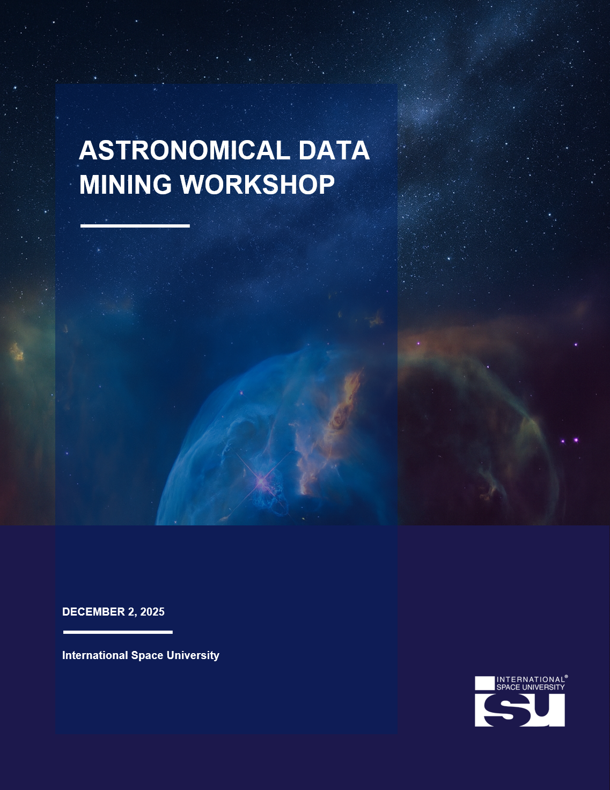

## Astronomical Data Mining

> "The study of the formation and evolution of open clusters (OC) and their stellar populations represent a backbone of research in modern astrophysics. Indeed, they have a strong impact on our understanding of key open issues, from the star formation process to the assembly and evolution of the Milky Way disk and galaxies in general." - Bossini et al. (2019)

Open clusters are used to see the structure of galaxies and their current fate.

Gaia is the current consensus for observation of Open clusters as it "provides homogeneous photometric data covering the whole sky, but also unprecedented high precision kinematics and parallax information, that are fundamental to obtain accurate membership and to identify new clusters" (Bossini et al., 2019).

In this study, we are using Gaia data release 3 (GDR3) to select and analyze one open cluster the NGC 4852 Gaia DR3.

 

    <a href="/#projects" class="button">Return to Projects</a>

