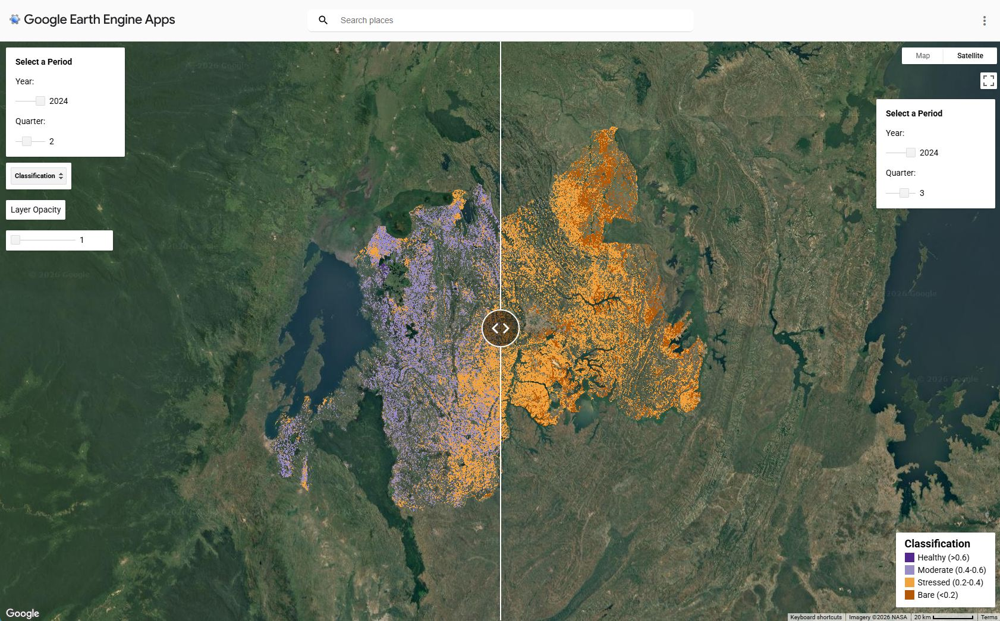

  

## Earth Observation - Google Earth Engine & EVI

Due to climate change, economic factors and socio-political factors, food insecurity has become a prominent problem in certain countries. The goal of this research is to use remote sensing technologies and analyse free accessible satellite data with the help of Artificial Intelligence (AI) to provide farming communities with valuable up-to-date information on vegetation health. Enabling communities to shift from reactive mitigation measures to more proactive precision agriculture. 

Focusing on Rwanda’s high-severity food security problem, Copernicus Sentinel-2 satellite data was processed within the free accessible Google Earth Engine (GEE) and the Enhanced Vegetation Index (EVI) was calculated and visualized. 

Based on the obtained EVI values, Rwanda’s AI generated agricultural area of interest was classified into four health categories. These results demonstrate the potential application of low-cost and scalable agricultural monitoring methods using RS coupled with AI. The future goal would be to establish a Pan-African GeoAI ecosystem that aligns with the United Nation’s Sustainable Development Goals and integrates Earth Observation, AI, and local knowledge.

**Interactive Application:**
<a href="https://isu-lceuranie.projects.earthengine.app/view/rwandacviappv2" target="_blank" class="app-link">
  <i class="fa fa-external-link"></i> Launch GEE Rwanda CVIA App
</a>

---

## GIS Project – QGIS, ARCGIS – To come

 

 

    <a href="javascript:history.back()" class="pro-back-button">
      <i class="fa fa-arrow-left"></i> Return to Projects
    </a>

