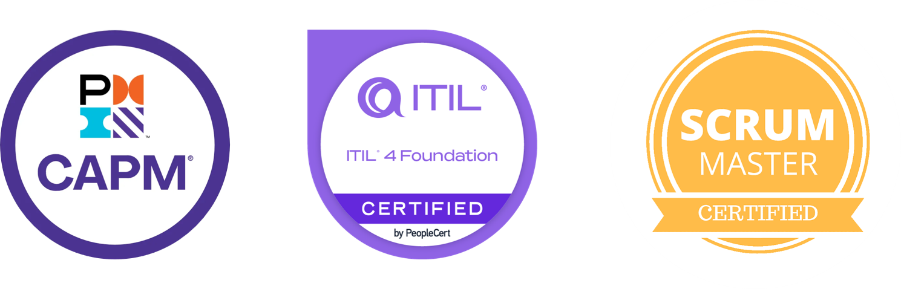

* **Leadership & Multidisciplinary Teams:** Managed multidisciplinary engineering teams (5–10 staff) through low to medium complexity Geosciences project life cycles ($50K USD to $250K USD).
* **Digital Transformation:** Directed multi-phase large scale information system digital transformation across Europe, improving data integrity by 50% and optimizing workflows.
* **Cross-Functional Coordination:** Coordinated cross-functional teams - including support functions (finance, IT, engineering, commercial) - to deliver 10+ technical projects, managing scope, schedule, risks, and stakeholder communication — equivalent to ESA internal work-package coordination.
* **Governance & Documentation:** Prepared structured documentation (process maps, risk logs, variance reports, dashboards) supporting decision-making, mirroring ESA’s programme review expectations.
* **Project Control:** Developed and maintained schedule and KPI dashboards, ensuring efficient coordination and 100% on-time release of project deliverables utilizing MS Project and Power BI. Monitored governance, variances, and progress tracking according to performance metrics within quality standards.
* **Change & Risk Management:** Executed change-request workflows and maintained alignment with contractual and compliance requirements. Developed a risk analytics dashboard across 50+ operations, enhancing team accountability and awareness.
* **Audits & Financials:** Oversaw 10+ audits, documented 50+ lessons learned, and managed close-out, handover, and on-time invoicing and collection.

 

 

    <a href="javascript:history.back()" class="pro-back-button">
      <i class="fa fa-arrow-left"></i> Return to Projects
    </a>

