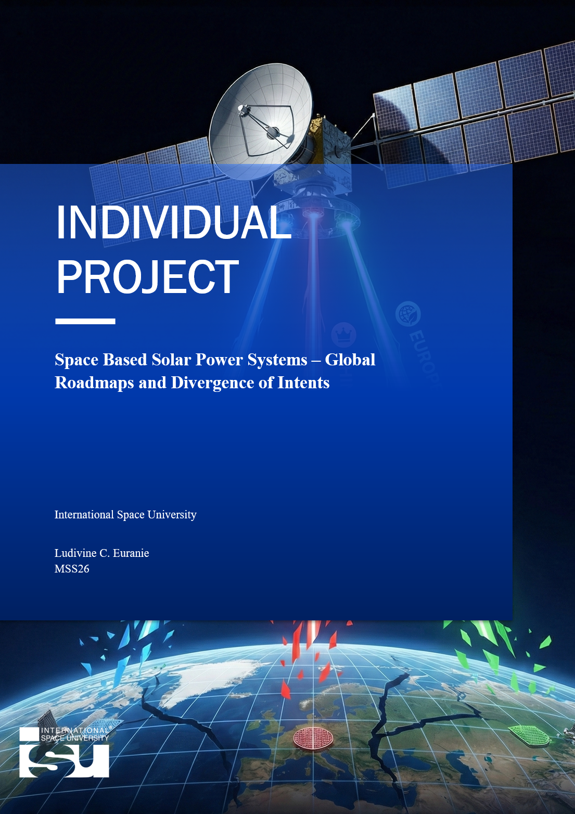

## Space Based Solar Power: Global Roadmap and Divergence of Intents

Since the first conceptualization of Space-Based Solar Power (SBSP) in 1968, the technology has transitioned from a concept to a technically deployable energy solution. However, despite over 50 years of intensive research, a unified international roadmap similar to the International Space Station (ISS) has failed to materialize. 
This report, structured through a thematic synthesis of architectural evolution and policy frameworks, argues that this failure is not a result of technical immaturity but of a "great divergence" in strategic intents. 

Tracing architectures from 1970s 'monolithic' designs to contemporary 'solid-state' lineages, this report shows major stakeholders – the US, China, and Europe – optimizing for exclusive metrics: economic parity, strategic dominance, and legislative decarbonization. 

The report identifies critical bottlenecks, including the "geopolitical super-bottleneck" of the current fragmented world order, and concludes that while the technology for global solar energy harvesting is ready, the required global intent is not.

 

    <a href="/#projects" class="button">Return to Projects</a>

